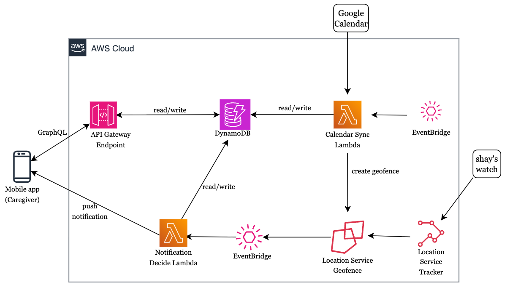

# Find Shai

Find Shai is an open source project that provides real-time geofencing based on your loved one's calendar.

## About

Our goal is to notify caregivers when their loved one enters or exits a location from their calendar.

**Notifications:**
- **Enter** - The loved one has arrived at a calendar event location
- **Exit** - The loved one has left a calendar event location

For detailed setup instructions (prerequisites, AWS configuration, troubleshooting), see the **[Setup Guide](find-shai/docs/SETUP.md)**.

For configuring hardcoded values (Loved One ID, calendar URL, device mapping), see the **[Configuration Guide](CONFIGURATION.md)**.

# Getting Started

The system consists of three main components:

1. **iOS Mobile App** - For caregivers to manage loved ones and receive notifications
2. **AWS Backend** - Serverless infrastructure for data storage and processing
3. **Watch App** - Worn by the loved one to send location updates

## System Diagram

